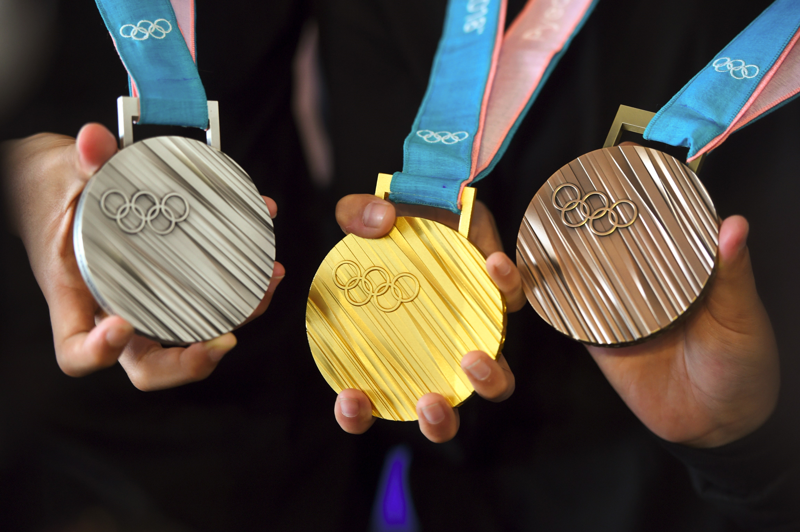

# A Data Visulization of Canadas Results in the Winter Olympics

To view: Simply open the index.html document within this repository to view the presented data.

Hello! 
The following document contains data that has been sampled form the IOC Research and Reference Service and Published by The Gaurdian's Datablog in reference to Olympic Medals and Sports from 1896-2014. In this document, I have analyzed What sports Canada excels at by calculating which sports Canada has won the most gold medals for. I have also looked at what medals Canada has won the most of and compared this to other Canadian rivals winnings. 
 

Built with:
Html
Python graphs

Built by:
Emily Morgan